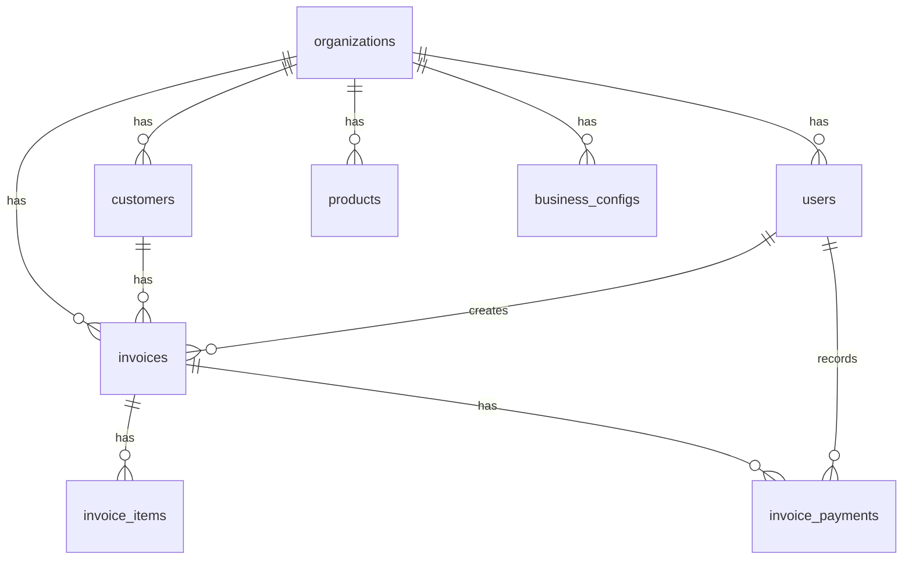

# Invoice Generator - Database Schema Documentation

## Overview
This document describes the database schema for the Invoice Generator SaaS application. The schema is designed to support multi-tenant organizations with complete isolation of data.

## Schema Diagram

```
organizations
    ↓
    ├── users (many-to-one)
    ├── customers (many-to-one)
    ├── products (many-to-one)
    ├── business_configs (many-to-one)
    └── invoices (many-to-one)
            ├── invoice_items (many-to-one)
            └── invoice_payments (many-to-one)
```

## Tables

### 1. Organizations (`organizations`)
The main tenant table that isolates data for each business/company.

| Field | Type | Description |
|-------|------|-------------|
| `id` | text (PK) | Unique identifier |
| `name` | text | Organization name |
| `description` | text | Organization description |
| `email` | text | Organization contact email |
| `phoneNumber` | text | Organization contact phone |
| `address` | text | Street address |
| `city` | text | City |
| `state` | text | State/Province |
| `country` | text | Country |
| `zipCode` | text | Postal/ZIP code |
| `website` | text | Organization website URL |
| `logo` | text | Logo image URL/path |
| `primaryColor` | text | Primary brand color (hex) - Default: #3B82F6 |
| `secondaryColor` | text | Secondary brand color (hex) - Default: #10B981 |
| `taxId` | text | Tax identification number |
| `registrationNumber` | text | Business registration number |
| `isActive` | boolean | Whether organization is active |
| `createdAt` | timestamp | Creation timestamp |
| `updatedAt` | timestamp | Last update timestamp |

**Features:**
- Brand customization (logo, primary/secondary colors)
- Complete business information for invoice generation
- Soft delete capability with `isActive` flag

---

### 2. Users (`users`)
Authentication and user management table.

| Field | Type | Description |
|-------|------|-------------|
| `id` | text (PK) | Unique identifier |
| `username` | text (unique) | Username for login |
| `name` | text | Full name |
| `email` | text (unique) | Email address |
| `phoneNumber` | text (unique) | Phone number |
| `password` | text | Hashed password |
| `organizationId` | text (FK) | Reference to organization |
| `isVerified` | boolean | Email/phone verification status |
| `image` | text | Profile image URL/path |
| `role` | enum | User role: `owner`, `admin`, `user` |
| `banned` | boolean | Whether user is banned |
| `banReason` | text | Reason for ban |
| `isActive` | boolean | Whether user is active |
| `createdAt` | timestamp | Creation timestamp |
| `updatedAt` | timestamp | Last update timestamp |

**Features:**
- Multi-user support per organization
- Role-based access control (owner, admin, user)
- User verification and ban management
- Cascade delete when organization is deleted

---

### 3. Customers (`customers`)
Customer/client information isolated per organization.

| Field | Type | Description |
|-------|------|-------------|
| `id` | text (PK) | Unique identifier |
| `organizationId` | text (FK) | Reference to organization |
| `name` | text | Customer name |
| `email` | text | Customer email |
| `phoneNumber` | text | Customer phone |
| `companyName` | text | Customer's company name |
| `address` | text | Street address |
| `city` | text | City |
| `state` | text | State/Province |
| `country` | text | Country |
| `zipCode` | text | Postal/ZIP code |
| `taxId` | text | Customer's tax ID |
| `notes` | text | Additional notes about customer |
| `isActive` | boolean | Whether customer is active |
| `createdAt` | timestamp | Creation timestamp |
| `updatedAt` | timestamp | Last update timestamp |

**Features:**
- Complete customer contact and billing information
- Organization-isolated data
- Soft delete with `isActive` flag
- Custom notes for customer management

---

### 4. Products (`products`)
Product/service catalog isolated per organization.

| Field | Type | Description |
|-------|------|-------------|
| `id` | text (PK) | Unique identifier |
| `organizationId` | text (FK) | Reference to organization |
| `name` | text | Product name |
| `description` | text | Product description |
| `sku` | text | Stock Keeping Unit |
| `price` | real | Product price |
| `unit` | text | Unit of measurement (pcs, kg, liter, etc.) |
| `category` | text | Product category |
| `image` | text | Product image URL/path |
| `isActive` | boolean | Whether product is active |
| `createdAt` | timestamp | Creation timestamp |
| `updatedAt` | timestamp | Last update timestamp |

**Features:**
- Flexible unit system
- Category support for organization
- Price tracking
- Product images

---

### 5. Business Configs (`business_configs`)
Customizable business settings for fees, taxes, etc.

| Field | Type | Description |
|-------|------|-------------|
| `id` | text (PK) | Unique identifier |
| `organizationId` | text (FK) | Reference to organization |
| `configKey` | text | Config identifier (e.g., "delivery_fee") |
| `configLabel` | text | Display label for the config |
| `configType` | enum | Type: `percentage` or `fixed` |
| `configValue` | real | The actual value |
| `isActive` | boolean | Whether config is active |
| `displayOrder` | integer | Sort order for UI display |
| `createdAt` | timestamp | Creation timestamp |
| `updatedAt` | timestamp | Last update timestamp |

**Features:**
- Fully customizable business configurations
- Support for both percentage and fixed values
- Examples: Delivery Fee, TAX, VAT, Service Charge, Discount
- Display order for consistent UI presentation

**Example Usage:**
```json
{
  "configKey": "vat",
  "configLabel": "VAT",
  "configType": "percentage",
  "configValue": 15
}
```

---

### 6. Invoices (`invoices`)
Main invoice/quotation table.

| Field | Type | Description |
|-------|------|-------------|
| `id` | text (PK) | Unique identifier |
| `organizationId` | text (FK) | Reference to organization |
| `customerId` | text (FK) | Reference to customer |
| `createdByUserId` | text (FK) | User who created the invoice |
| `invoiceNumber` | text | Invoice/Quotation number |
| `invoiceType` | enum | Type: `invoice` or `quotation` |
| `status` | enum | Status: `draft`, `pending`, `paid`, `partially_paid`, `overdue`, `cancelled` |
| `issueDate` | timestamp | Issue date |
| `dueDate` | timestamp | Due date (optional) |
| `subtotal` | real | Subtotal before taxes/fees |
| `totalTax` | real | Total tax amount |
| `totalDiscount` | real | Total discount amount |
| `deliveryFee` | real | Delivery fee |
| `otherCharges` | real | Any additional charges |
| `totalAmount` | real | Final total amount |
| `paidAmount` | real | Amount already paid |
| `dueAmount` | real | Amount still due |
| `specialNote` | text | Special note for customer (shown on invoice) |
| `termsAndConditions` | text | Terms and conditions |
| `internalNotes` | text | Private notes (not shown on invoice) |
| `paymentMethod` | text | Payment method used |
| `paymentReference` | text | Payment reference number |
| `createdAt` | timestamp | Creation timestamp |
| `updatedAt` | timestamp | Last update timestamp |
| `paidAt` | timestamp | Payment completion timestamp |

**Features:**
- Supports both invoices and quotations
- Draft functionality - save incomplete invoices
- Comprehensive payment tracking
- Special notes for customization
- Internal notes for team communication
- Only invoices (not quotations) affect account balances

**Invoice Types:**
- **Invoice**: Affects customer accounts (due, total sell)
- **Quotation**: Does not affect accounts until converted to invoice

**Status Flow:**
- `draft` → Customer can save incomplete invoice
- `pending` → Invoice issued, awaiting payment
- `partially_paid` → Partial payment received
- `paid` → Fully paid
- `overdue` → Past due date
- `cancelled` → Invoice cancelled

---

### 7. Invoice Items (`invoice_items`)
Line items for each invoice.

| Field | Type | Description |
|-------|------|-------------|
| `id` | text (PK) | Unique identifier |
| `invoiceId` | text (FK) | Reference to invoice |
| `productName` | text | Product name (preserved even if product deleted) |
| `productDescription` | text | Product description |
| `quantity` | real | Quantity |
| `unit` | text | Unit of measurement |
| `unitPrice` | real | Price per unit |
| `discount` | real | Discount value |
| `discountType` | enum | Type: `percentage` or `fixed` |
| `tax` | real | Tax value |
| `taxType` | enum | Type: `percentage` or `fixed` |
| `lineTotal` | real | Total for this line item |
| `displayOrder` | integer | Display order |
| `createdAt` | timestamp | Creation timestamp |
| `updatedAt` | timestamp | Last update timestamp |

**Features:**
- Stores product data to preserve invoice history
- Flexible discount and tax per line item
- Display order for consistent presentation

**Calculation:**
```
lineTotal = (quantity * unitPrice) - discount + tax
```

---

### 8. Invoice Payments (`invoice_payments`)
Payment tracking for invoices.

| Field | Type | Description |
|-------|------|-------------|
| `id` | text (PK) | Unique identifier |
| `invoiceId` | text (FK) | Reference to invoice |
| `amount` | real | Payment amount |
| `paymentMethod` | text | Payment method |
| `paymentReference` | text | Payment reference/transaction ID |
| `paymentDate` | timestamp | Date of payment |
| `notes` | text | Payment notes |
| `createdByUserId` | text (FK) | User who recorded the payment |
| `createdAt` | timestamp | Creation timestamp |
| `updatedAt` | timestamp | Last update timestamp |

**Features:**
- Track multiple payments per invoice
- Support for partial payments
- Payment method and reference tracking
- Audit trail with user tracking

---

## Key Design Decisions

### 1. **Multi-Tenancy**
- All data is isolated by `organizationId`
- Cascade delete ensures data cleanup when organization is removed
- Each organization has complete independence

### 2. **Invoice vs Quotation**
- Same table structure, differentiated by `invoiceType`
- Only invoices affect customer account balances
- Quotations can be converted to invoices

### 3. **Draft Functionality**
- Status field supports `draft` state
- Users can save incomplete invoices and return later
- Draft invoices don't affect customer accounts

### 4. **Data Preservation**
- Product names/descriptions stored in invoice items
- Ensures invoice history remains intact even if products are deleted/modified

### 5. **Flexible Configuration**
- Business configs support both percentage and fixed values
- Customizable per organization
- Can add new config types without schema changes

### 6. **Payment Tracking**
- Separate payment table for detailed tracking
- Support for multiple partial payments
- Automatic calculation of due amounts

### 7. **Brand Customization**
- Organization-level brand colors
- Logo support
- Special notes per invoice

## Relationships



## Indexes Recommendation

For optimal performance, consider adding indexes on:

1. **Foreign Keys:**
   - `users.organizationId`
   - `customers.organizationId`
   - `products.organizationId`
   - `business_configs.organizationId`
   - `invoices.organizationId`
   - `invoices.customerId`
   - `invoice_items.invoiceId`
   - `invoice_payments.invoiceId`

2. **Unique Fields:**
   - `users.email`
   - `users.phoneNumber`
   - `users.username`

3. **Query Optimization:**
   - `invoices.status`
   - `invoices.invoiceType`
   - `invoices.issueDate`
   - `business_configs.configKey`

## Migration Strategy

When deploying, ensure migrations run in this order:
1. Create `organizations` table
2. Create `users` table
3. Create `customers` table
4. Create `products` table
5. Create `business_configs` table
6. Create `invoices` table
7. Create `invoice_items` table
8. Create `invoice_payments` table

## Example Queries

### Get all invoices for an organization with customer details
```typescript
const invoices = await db
  .select()
  .from(invoice)
  .leftJoin(customer, eq(invoice.customerId, customer.id))
  .where(eq(invoice.organizationId, orgId));
```

### Get invoice with items and payments
```typescript
const invoiceData = await db
  .select()
  .from(invoice)
  .leftJoin(invoiceItem, eq(invoice.id, invoiceItem.invoiceId))
  .leftJoin(invoicePayment, eq(invoice.id, invoicePayment.invoiceId))
  .where(eq(invoice.id, invoiceId));
```

### Get active business configs for organization
```typescript
const configs = await db
  .select()
  .from(businessConfig)
  .where(
    and(
      eq(businessConfig.organizationId, orgId),
      eq(businessConfig.isActive, true)
    )
  )
  .orderBy(businessConfig.displayOrder);
```

